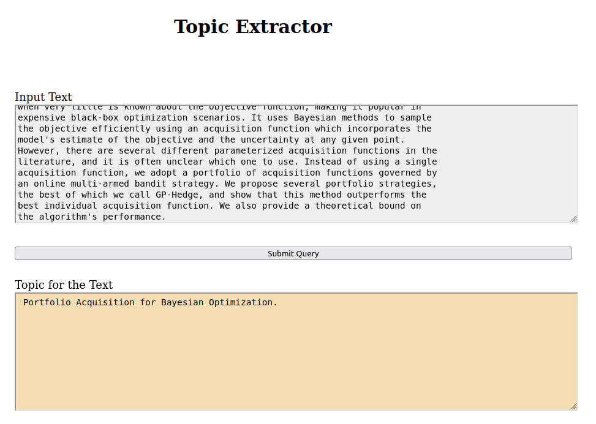
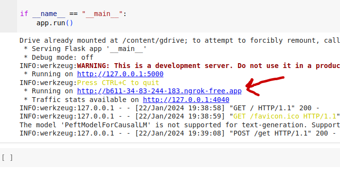

# Llama_Topic_Extraction
**Llama fine tuning for Topic Modeing**

**Dependencies and Configuations**
- [x] pip install q torch peft==0.4.0 bitsandbytes==0.40.2 transformers==4.31.0 trl==0.4.7 accelerate
- [x] pip install flask pyngrok==4.1.1 flask-ngrok
- [x] GPU on Google Colab
- [x] Google Golab `'drive.mount('/content/gdrive')'`
- [x] Flask HTML template `'index8.html'` needs to be loaded on Google Drive

**Source Code**
 - Run  `'LLAMA_Tuned_Flask.ipython'`

**Flask API**

Click on the link to access the Interface.

